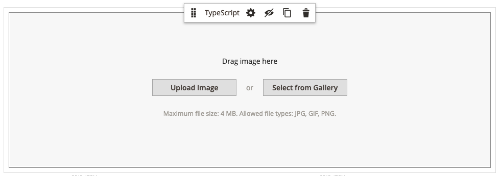
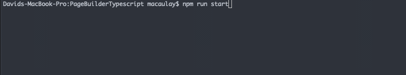

# Magento Page Builder - TypeScript

This module serves as an example Page Builder module utilising TypeScript. This example module also contains the stage inline image uploader.



The tooling within this repository do commit the generated TypeScript into the version control system. If you have sufficient build tools you can modify these scripts to only build when you're releasing.

## Usage
You can install the dependencies within this module using:
```bash
npm install
```

Whilst developing you can run the following command to start the watch commands for Babel's TypeScript compiler and our error output from tsc.
```bash
npm run start
```
This command will also watch for file updates and automatically compile them for you. This command is required to be running in the background when developing with TypeScript.


There are a number of other commands that can be viewed within `package.json`.

## TypeScript Location
All TypeScript files are located within `view/adminhtml/web/ts/js`, the tooling within this module builds the generated TypeScript into `view/adminhtml/web/js` and ensures Magento's built in RequireJS runtime can correctly load it.

## Page Builder Types
If you're familiar with TypeScript you'll know you need to include `@types` packages when working with external dependencies. We have published our Page Builder type definitions to GitHub and they are available here: https://github.com/magento-obsessive-owls/page-builder-types.

These are listed as a dependency for this module, `page-builder-types` also contains other `@types` packages needed by Magento 2 & Page Builder to function.
- `@types/jquery`
- `@types/jqueryui`
- `@types/knockout`
- `@types/magento2`: https://github.com/magento/ts-types.git
- `@types/requirejs`
- `@types/slick-carousel`
- `@types/tinycolor`
- `@types/tinymce`
- `@types/underscore`

## Structure
There are a number of crucial files throughout the module to enable TypeScript compilation. If you plan to enable your module to use this tooling you'll need to ensure these files are present.
- `package.json`: Contains standard npm dependencies
- `tslint.json`: Our TSLint configuration for Page Builder
- `tsconfig.json`: Our TSC configuration for Page Builder
- `view/adminhtml/web/ts/.babelrc.js`: Our Babel configuration to compile the TypeScript into JavaScript.
- `view/adminhtml/web/ts/babel/*`: Specific Babel plugins used to ensure compatibility between generated classes and Magento.